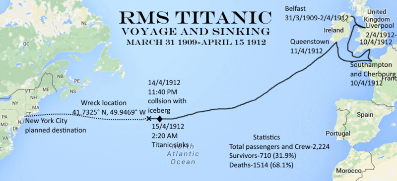
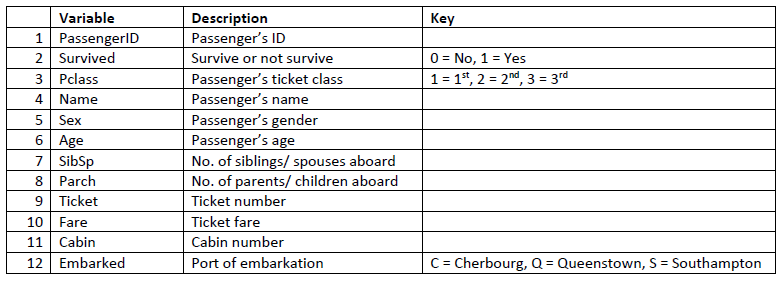
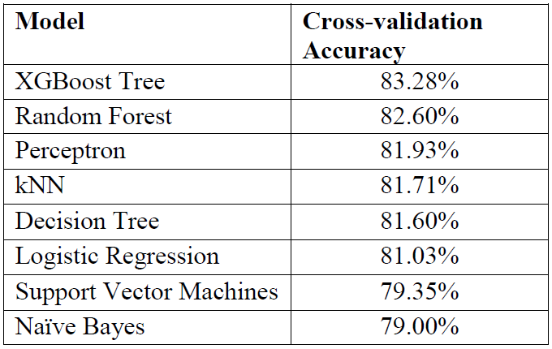

<style>
body {
text-align: justify}
</style>

```{r setup, include=FALSE}
library(dplyr)
library(ggplot2)
library(ggridges)
library(plotly)
library(gridExtra)
library(timereg)
library(alluvial)
library(ggalluvial)
library(GGally)
library(kableExtra)
knitr::opts_chunk$set(echo = TRUE)
```

# 1.0 Introduction

RMS Titanic was a British passenger liner that sank in the North Atlantic Ocean in the early morning hours of 15 April 1912, after it collided with an iceberg during its maiden voyage from UK to New York City. There were an estimated 2224 passengers and crew aboard the ship, and more than 1500 died, making it one of the deadliest commercial peacetime maritime disasters in modern history. Below is the journey map of Titanic:

```{r titanic_journey, echo=FALSE, fig.cap="Fig 1: Titanic Journey Map", out.width="100%"}

```

## 1.1 Data Overview

There are 891 observations and 12 variables in this dataset. This dataset consists only 40% of the overall 2254 passengers and crew on-board of Titanic.
```{r raw_data, echo=FALSE}
df <- read.csv("Titanic.csv", stringsAsFactors = F, na.strings = c("")) 
# by default, read.csv will convert all strings variables to factors, want to avoid that because we dont know if any missing values in those variables
df$Survived <- as.factor(df$Survived)
df$Sex <- as.factor(df$Sex)
df$Pclass <- as.factor(df$Pclass)
df$Embarked <- as.factor(df$Embarked)
str(df)
```

```{r data_dict, echo=FALSE, fig.cap="Fig 2: Variables Description", out.width="100%"}

```
Above are the descriptions of these variables. There are some extra explanations for these variables:
  
  * 1st class ticket means the fare is the most expensive amongst the 3 classes.
  * The age is actually fractional if less than 1 and if it is estimated, it is in the form of xx.5
  * Siblings also include step-siblings.
  * Children also include step-children.

The missing values in each variable are shown next:
```{r missing_values, echo=FALSE}
sapply(df, function(x){sum(is.na(x))})
#df %>% summarise_all(list(~sum(is.na(.))))
```
The variable **'Age'** and **'Cabin'** are missing a substantial amount of values. **'Embarked'** has 2 missing values.

**Summary of the data: **
```{r summary, echo=FALSE}
summary(df)
```

  * There are 342 out of 891 people (`r round(((342/891)*100),2)`%) survived in this sample of data, which is slighly more than the reported 31.9% survival rate.
  * Majority of the passengers were travelling with 3rd class ticket (`r round(((491/891)*100),2)`%), whereas `r round(((184/891)*100),2)`% with 2nd class ticket and `r round(((216/891)*100),2)`% with 1st class ticket.
  * Majority of the passengers were male (577 out of 891).
  * Majority of the passengers embarked from Southampton port (`r round(((644/891)*100),2)`%), followed by Cherbourg (`r round(((168/891)*100),2)`%) and Queenstown (`r round(((77/891)*100),2)`%).

As for numerical variables such as **Age**, **SibSp**, **Parch**, and **Fare**, histograms will be used to visualise the distributions of these variables.

```{r dist_plots, echo=FALSE, message=FALSE, warning=FALSE}
age_dist <- ggplot(df, aes(Age)) + geom_histogram(aes(y = ..density..), fill = "blueviolet", color = "black") + 
  geom_density() + geom_vline(xintercept = mean(df$Age, na.rm=T), lty = 2, size = 1) +
  scale_y_continuous(labels = scales::percent) + ylab("Density") + ggtitle("Age Distribution of Raw Data")

sibsp_dist <- ggplot(df, aes(SibSp)) + geom_bar(aes(y = (..count..)/sum(..count..)), fill = "violetred3", color = "black") +
  scale_y_continuous(labels = scales::percent) + ylab("Percentage") + ggtitle("SibSp Distribution of Raw Data")

parch_dist <- ggplot(df, aes(Parch)) + geom_bar(aes(y = (..count..)/sum(..count..)), fill = "springgreen", color = "black") +
  scale_y_continuous(labels = scales::percent) + ylab("Percentage") + ggtitle("Parch Distribution of Raw Data")

fare_dist <- ggplot(df, aes(Fare)) + geom_histogram(aes(y = ..density..), fill = "goldenrod1", color = "black") +
  geom_vline(xintercept = mean(df$Fare), lty = 2, size = 1) +
  scale_y_continuous(labels = scales::percent) + ylab("Density") + ggtitle("Fare Distribution of Raw Data")

grid.arrange(age_dist, sibsp_dist, parch_dist, fare_dist, ncol = 2)
```
  
  * The distribution of age is positively skewed, majority of the passengers were between 20 to 40 years old.
  * Majority of the passengers did not aboard along siblings, spouses, parents, and children.
  * Interestingly, majority of the fare price is 0, probably those are crew or a lot of passengers were invited to aboard Titanic for its maiden voyage for free.

```{r fare_vs_pclass, include=FALSE}
# check the distribution of fare for each ticket class
ggplot(df, aes(x = Fare, y = Pclass, fill = Pclass)) + geom_density_ridges() + ggtitle("Distribution of Fare in each Pclass")

# most of the 0 fare are 3rd class and the fares were generally higher for 1st class.
```
## 1.2 Impute Missing Data

The variables **'Age'**, **'Cabin'**, and **'Embarked'** have missing values. **'Cabin'** will be dropped from the data since it has 687 missing values. As for the **'Age'**, it has 177 missing values and we will deal with that later. In this section, **'Embarked'** which only has 2 missing values will be imputed. Below shows which observations have the missing **'Embarked'** value:
```{r missing_embarked, echo=FALSE}
df[which(is.na(df$Embarked)),]
```
We can see that both of the passengers are female, traveled with 1st class ticket and both paid 80 for the fares. The fare might be able to tell which ports they were embarked on.
```{r fare_pclass_ports, echo=FALSE}
medianfare <- df %>% filter(!is.na(Embarked)) %>% select(Embarked, Pclass, Fare) %>%
  group_by(Embarked, Pclass) %>% summarise(MedianFare = median(Fare))

kable(medianfare) %>% kable_styling(bootstrap_options = c("striped", "hover", "responsive"), full_width = F, position = "left")
```
Median fare value is used since the distribution of fare is irregular. Fare of 80 is very close to the median fare value of 1st class ticket embarked from Cherbourg. We will impute the 2 missing value with Cherbourg.
```{r impute_embark, echo=FALSE}
df[(df$PassengerId == 62 | df$PassengerId == 830), "Embarked"] <- "C"
df$Embarked <- as.factor(df$Embarked)
df[(df$PassengerId == 62 | df$PassengerId == 830),]
```
The missing values in **'Age'** will be dealt in later section.

# 2.0 Feature Engineering

Feature enginnering is an approach to create additional relevant features (variables) from the existing raw data so that more insights can be exploited and then the predictive power of the predictive models can be increased.

### 2.0.1 Social Titles of Passengers
Notice that the **Name** variable does not only contain the first, middle and last names of the passengers, it also contains the social titles of the passengers (Mr., Mrs., Miss., Col., etc.). These titles related to the passengers' gender, age, marital status, and contains military ranks, clergy, Royal and other Nobles. These titles might be helpful in representing the social status of the passengers and it may help to predict if a person with Noble status is more likely to survive or not. Below are all the titles that can be extracted in this dataset:

```{r title, echo=FALSE}
df$Title <- sapply(df$Name, function(x){strsplit(x, split = '[,.]')[[1]][2]})
df$Title <- sub(" ", "", df$Title)
kable(table(df$Sex, df$Title)) %>% kable_styling(bootstrap_options = c("striped", "hover", "responsive"))
```

There are various social titles and we want to group them into few representative categories. First off, Master is a title used to address young boys who are not old enough to be addressed as Mister (Mr.) and since there are 40 of them, we will maintain **Master** as a group itself. **Mr** is also a group itself. Next, it is hard to classify equivalent young ladies since there isn't general title for them. So we can classify the women into married and unmarried. Miss, Ms, and Mlle (Mademoiselle in French) are to be classified as **Miss** (unmarried women) whereas Mrs and Mme (Madame in French) are to be classified as **Mrs** (married women). Lastly, the military, clergy, Royal, and other Noble titles are to be grouped together as **Noble**.

```{r title_group, echo=FALSE}
df$Title[df$Title %in% c("Ms", "Mlle")] <- "Miss"
df$Title[df$Title == "Mme"] <- "Mrs"
df$Title[!(df$Title %in% c("Miss", "Mrs", "Master", "Mr"))] <- "Noble"
df$Title <- as.factor(df$Title)
kable(table(df$Sex, df$Title)) %>% kable_styling(bootstrap_options = c("striped", "hover", "responsive"), full_width = F, position = "left")
```

### 2.0.2 Family Size aboard

There are **SibSp** and **Parch** indicate how many siblings, spouses, parents and children a passenger traveled aboard with. We want to create another feature which combine both of these variables to indicate the total family members included the passenger traveled aboard the Titanic, called **FamSize**.

```{r family_size, echo=TRUE}
df$FamSize <- df$SibSp + df$Parch + 1
```

With that feature, we can also create another feature to indicate whether the passenger traveled alone, called **IsAlone** where `IsAlone = 1 if FamSize = 1` and `IsAlone = 0 if FamSize > 1`.

```{r alone, echo=TRUE}
df$IsAlone <- if_else(df$FamSize > 1, 0, 1)
df$IsAlone <- as.factor(df$IsAlone)
```

### 2.0.3 Fare Bin

The Fare is a continuous variable, so we want to classify the Fare into few bins (groups). `qcut` function is used so that the Fare is grouped by its quartile ranges.

```{r fare_bin, echo=TRUE}
df$FareBin <- qcut(df$Fare, cuts = 4)
df$FareBin <- as.factor(df$FareBin)
```

## 2.1 Impute Missing Age

There are 177 missing values in Age variable. Just by replacing with the mean/ median age might not be the best solution because the age might be differing by categories of passengers. The social title might provides clues to impute the missing age.

```{r title_age_plot, echo=FALSE, message=FALSE, warning=FALSE}
title_age <- ggplot(df, aes(x = Title, y = Age, fill = Title)) + geom_boxplot() + 
  ggtitle("Age Distribution by Title") + theme_light()

ggplotly(title_age)
```

```{r title_age, echo=FALSE}
medianAge <- df %>% filter(!is.na(Age)) %>% group_by(Title) %>% summarise(MedianAge = median(Age))

kable(medianAge) %>% kable_styling(bootstrap_options = c("striped", "hover", "responsive"), full_width = F, position = "left") 
```

From the boxplot above, there is a distinction in distribution of age by different titles. Median age of each title will be imputed to the missing values according to the passengers' titles.

```{r impute_age, echo=TRUE}
df$Age[df$Title == "Master" & is.na(df$Age)] <- 3.5
df$Age[df$Title == "Miss" & is.na(df$Age)] <- 21
df$Age[df$Title == "Mr" & is.na(df$Age)] <- 30
df$Age[df$Title == "Mrs" & is.na(df$Age)] <- 35
df$Age[df$Title == "Noble" & is.na(df$Age)] <- 48.5
```

### 2.1.1 Age Group

Now that the missing ages are imputed, we want to look at the age distribution by survival status to glean any insights.

```{r survival_age_plot, echo=FALSE}
survival_age <- ggplot(df, aes(x = Age, fill = Survived)) + geom_density(alpha = 0.4) +
  scale_y_continuous(labels = scales::percent) + ylab("Density") + ggtitle("Survival Density by Age Distribution")

ggplotly(survival_age)
```

Those younger than around 16 had a high survival rate which provides good information. The age band between 24 and 80 shows survival is unfavourable. It is not very informative as most passengers did not survive to begin with. We will classify the passengers in this new feature **AgeGroup** by those who were 16 years and below and those who were not.

```{r age_group, echo=TRUE}
df$AgeGroup <- if_else(df$Age <= 16, "<=16", ">16")
df$AgeGroup <- as.factor(df$AgeGroup)
```

# 3.0 Exploratory Data Analysis

With data processing and cleaning done, we now want to explore the data more deeply with the help of visualisation tools.

## 3.1 Relationships between Survival Rate and other Variables {.tabset .tabset-pills}

**Note: Go through each tabs for different variables, some of the plots are interactive, hover mouse cursor to view the data presented.**

### Sex

```{r survival_sex_plot, echo=FALSE}
survival_sex <- ggplot(df, aes(x = Sex, fill = Survived)) + geom_bar(position = "fill") +
  geom_hline(yintercept = mean(as.numeric(as.character(df$Survived))), col = "white", lty = 2, size = 2) +
  scale_y_continuous(labels = scales::percent) + ylab("Survival Rate") + ggtitle("Survival Rate by Sex")

ggplotly(survival_sex)
```

74.2% of females survived the disaster which is far above the mean survival rate of 38.4%, whereas only 18.9% of males survived which is far below the mean survival rate. This shows females survived at a higher rate than the males.

### Pclass

```{r survival_pclass_plot, echo=FALSE}
survival_pclass <- ggplot(df, aes(x = Pclass, fill = Survived)) + geom_bar(position = "fill") +
  geom_hline(yintercept = mean(as.numeric(as.character(df$Survived))), col = "white", lty = 2, size = 2) +
  scale_y_continuous(labels = scales::percent) + scale_fill_brewer(palette = "Dark2") +
  ylab("Survival Rate") + ggtitle("Survival Rate by Pclass")

ggplotly(survival_pclass) 
```

63% of passengers traveled with 1st class ticket survived, 47.3% of passengers traveled with 2nd class ticket survived, and only 24.2% of passengers traveled with 3rd class ticket survived, compared to the mean survival rate of 38.4%. 

### AgeGroup

```{r survival_agegroup_plot, echo=FALSE}
survival_agegroup <- ggplot(df, aes(x = AgeGroup, fill = Survived)) + geom_bar(position = "fill") +
  geom_hline(yintercept = mean(as.numeric(as.character(df$Survived))), col = "white", lty = 2, size = 2) +
  scale_y_continuous(labels = scales::percent) + ylab("Survival Rate") +
  scale_fill_manual(values = c("plum", "darkgreen")) + ggtitle("Survival Rate by AgeGroup")

ggplotly(survival_agegroup)
```

Children and teens aged 16 and below survived at 54.8%. Passengers who were above 16 years old survived at 36.2% which is closed to the mean survival rate.

### Family

In this section, we will look at **SibSp**, **Parch**, and **FamSize**.

```{r survival_sibsp_parch_plot, echo=FALSE, out.width="100%", fig.height=3}
survival_sibsp <- ggplot(df, aes(x = SibSp, fill = Survived)) + geom_bar(position = "fill") +
  geom_hline(yintercept = mean(as.numeric(as.character(df$Survived))), col = "white", lty = 2, size = 2) +
  scale_y_continuous(labels = scales::percent) + ylab("Survival Rate") +
  scale_fill_brewer(palette = "Paired") + ggtitle("Survival Rate by SibSp")

survival_parch <- ggplot(df, aes(x = Parch, fill = Survived)) + geom_bar(position = "fill") +
  geom_hline(yintercept = mean(as.numeric(as.character(df$Survived))), col = "white", lty = 2, size = 2) +
  scale_y_continuous(labels = scales::percent) + ylab("Survival Rate") +
  scale_fill_brewer(palette = "Set2") + ggtitle("Survival Rate by Parch")

grid.arrange(survival_sibsp, survival_parch, nrow = 1)
```

```{r survival_famsize_plot, echo=FALSE}
survival_famsize <- ggplot(df, aes(x = FamSize, fill = Survived)) + geom_bar(position = "fill") +
  geom_hline(yintercept = mean(as.numeric(as.character(df$Survived))), col = "white", lty = 2, size = 2) +
  scale_y_continuous(labels = scales::percent) + ylab("Survival Rate") +
  scale_fill_brewer(palette = "Set1") + ggtitle("Survival Rate by FamSize")

ggplotly(survival_famsize)
```

There is no clear takeaway from how family size could affect the survival rate.

### IsAlone

```{r survival_isalone_plot, echo=FALSE}
survival_isalone <- ggplot(df, aes(x = IsAlone, fill = Survived)) + geom_bar(position = "fill") +
  geom_hline(yintercept = mean(as.numeric(as.character(df$Survived))), col = "white", lty = 2, size = 2) +
  scale_y_continuous(labels = scales::percent) + ylab("Survival Rate") +
  scale_fill_manual(values = c("wheat3", "slateblue4")) + ggtitle("Survival Rate by IsAlone")

ggplotly(survival_isalone)
```

Passengers who were traveling alone had a lower survival rate (30.4%) than those traveling with family members (50.6%).

### Embarked

```{r survival_embark_plot, echo=FALSE}
survival_embarked <- ggplot(df, aes(x = Embarked, fill = Survived)) + geom_bar(position = "fill") +
  geom_hline(yintercept = mean(as.numeric(as.character(df$Survived))), col = "white", lty = 2, size = 2) +
  scale_y_continuous(labels = scales::percent) + ylab("Survival Rate") +
  scale_fill_manual(values = c("goldenrod1", "darkorchid3")) + ggtitle("Survival Rate by Embarked")

ggplotly(survival_embarked)
```

Those embarked on Cherbourg had the highest survival rate (55.9%), followed by those emabrked on Queenstown (39%) and Southampton (33.7%).

### Fare

```{r survival_fare_plot, echo=FALSE}
survival_fare <- ggplot(df, aes(x = Fare, fill = Survived)) + geom_density(alpha = 0.5) +
  scale_y_continuous(labels = scales::percent) + ylab("Density") + 
  scale_fill_manual(values = c("violetred4", "darkorange1")) + ggtitle("Survival Rate by Fare Distribution")

ggplotly(survival_fare)
```

The survival rate increased as the fare is getting higher. We will explore this by looking at the breakdown of fare groups (FareBin).

```{r survival_farebin_plot, echo=FALSE}
survival_farebin <- ggplot(df, aes(x = FareBin, fill = Survived)) + geom_bar(position = "fill") +
  geom_hline(yintercept = mean(as.numeric(as.character(df$Survived))), col = "white", lty = 2, size = 2) +
  scale_y_continuous(labels = scales::percent) + ylab("Survival Rate") +
  scale_fill_manual(values = c("violetred4", "darkorange1")) + ggtitle("Survival Rate by FareBin")

ggplotly(survival_farebin)
```

Those who bought the fare for 31 and above survived at the highest rate (58.1%) followed by those bought the fare for 14.5 - 31 (45.5%). Those who bought the fare below 7.91 survived at the rate of 19.7%.

### Title

```{r survival_title_plot, echo=FALSE}
survival_title <- ggplot(df, aes(x = Title, fill = Survived)) + geom_bar(position = "fill") +
  geom_hline(yintercept = mean(as.numeric(as.character(df$Survived))), col = "white", lty = 2, size = 2) +
  scale_y_continuous(labels = scales::percent) + ylab("Survival Rate") +
  scale_fill_manual(values = c("deeppink3", "dodgerblue2")) + ggtitle("Survival Rate by Title")

ggplotly(survival_title)
```

The survival rate of Miss (70.3%) and Mrs (79.4%) are the highest while the survival rate of Mr (15.7%) is the lowest, which in line with the finding that females have a very much higher survival rate than males. The survival rate of Master (57.5%) is also in line with the finding that children survived at higher rate. Passengers with Noble title have a survival rate of 34.8%.

## 3.2 Relationships between Survival Rate and other Variables with Interaction {.tabset .tabset-fade}

**Note: Go through each tabs for different variables, some of the plots are interactive, hover mouse cursor to view the data presented.**

### Sex and Pclass

```{r survival_sex_pclass_plot, echo=FALSE}
survival_sex_pclass <- ggplot(df, aes(x = Sex, fill = Survived)) + geom_bar(position = "fill") + facet_wrap(~Pclass, labeller = label_both) +
  geom_hline(yintercept = mean(as.numeric(as.character(df$Survived))), col = "white", lty = 2, size = 2) +
  scale_y_continuous(labels = scales::percent) + ylab("Survival Rate") +
  scale_fill_manual(values = c("maroon2", "turquoise3")) + ggtitle("Survival Rate by Sex and Pclass")

ggplotly(survival_sex_pclass)
```

Female passengers with 1st class tickets almost all survived (96.8%), the high survival rate also hold for female passengers with 2nd class tickets (92.1%), whereas the female passengers with 3rd class tickets had a survival rate of 50%.

The same pattern hold for male passengers where 1st class survival rate > 2nd class survival rate > 3rd class survival rate, but with much lower survival rate compared to female passengers.

### AgeGroup and Pclass

```{r survival_agegroup_pclass_plot, echo=FALSE}
survival_agegroup_pclass <- ggplot(df, aes(x = AgeGroup, fill = Survived)) + geom_bar(position = "fill") + 
  facet_wrap(~Pclass, labeller = label_both) +
  geom_hline(yintercept = mean(as.numeric(as.character(df$Survived))), col = "white", lty = 2, size = 2) +
  scale_y_continuous(labels = scales::percent) + ylab("Survival Rate") +
  scale_fill_manual(values = c("firebrick3", "cyan3")) + ggtitle("Survival Rate by AgeGroup and Pclass")

ggplotly(survival_agegroup_pclass)
```

Those aged 16 years old and below traveled with 1st and 2nd class tickets had a very high survival rate (88.9% and 90.5% respectively). Those aged above 16 years old traveled with 1st class ticket also survived at a high rate (61.8%) which further indicate that the survival odds of 1st class passengers are high.

### Sex and AgeGroup

```{r survival_sex_agegroup_plot, echo=FALSE}
survival_sex_agegroup <- ggplot(df, aes(x = AgeGroup, fill = Survived)) + geom_bar(position = "fill") + facet_wrap(~Sex, labeller = label_both) +
  geom_hline(yintercept = mean(as.numeric(as.character(df$Survived))), col = "white", lty = 2, size = 2) +
  scale_y_continuous(labels = scales::percent) + ylab("Survival Rate") +
  scale_fill_manual(values = c("darkorange", "royalblue")) + ggtitle("Survival Rate by Sex and AgeGroup")

ggplotly(survival_sex_agegroup)
```

Interestingy, among the females, those who were aged above 16 years old survived at higher rate than those who were 16 years old and below. Whereas among the males, those who were 16 years old and below survived at much higher rate those those who were aged 16 years old and above.

### Fare and Pclass

```{r survival_fare_pclass_plot, echo=FALSE, message=FALSE, warning=FALSE}
survival_fare_pclass <- ggplot(df, aes(x = Pclass, y = Fare, fill = Survived, color = Survived)) + geom_boxplot() +
  scale_y_log10() + ylab("Fare (log scale)") + annotation_logticks(sides = "l") + scale_color_manual(values = c("darkred", "darkgreen")) +
  scale_fill_manual(values = c("violetred", "springgreen3")) + ggtitle("Distribution of Fare on Different Pclass") + theme_light()

survival_fare_pclass
```

Interestingly, for the 1st class and 2nd class ticket, the median fare for those who survived is higher than those who did not.

### Title and Pclass

```{r survival_title_pclass_plot, echo=FALSE}
survival_title_pclass <- ggplot(df, aes(x = Title, fill = Survived)) + geom_bar(position = "fill") + 
  facet_grid(Pclass~., labeller = label_both) +
  geom_hline(yintercept = mean(as.numeric(as.character(df$Survived))), col = "white", lty = 2, size = 2) +
  scale_y_continuous(labels = scales::percent) + ylab("Survival Rate") +
  scale_fill_manual(values = c("slateblue", "deeppink4")) + ggtitle("Survival Rate by Title and Pclass")

ggplotly(survival_title_pclass)
```

Masters traveled in 1st and 2nd class all survived (100%) whereas Masters traveled in 3rd class had survival rate of 39.3%. As established before, Miss and Mrs traveled at 3rd class had survival rate of 50%. Nobles traveled only in 1st class and 2nd class, those in 1st class had a survival rate of 53.3% whereas those in 2nd class did not survive. Mr had the lowest survival rate amongst all the Title groups, although the odds to survive is slightly higher if they traveled in 1st class.  

### IsAlone and Embarked

```{r survival_isalone_embarked_plot, echo=FALSE}
survival_isalone_embarked <- ggplot(df, aes(x = IsAlone, fill = Survived)) + geom_bar(position = "fill") + 
  facet_wrap(~Embarked, labeller = label_both) +
  geom_hline(yintercept = mean(as.numeric(as.character(df$Survived))), col = "white", lty = 2, size = 2) +
  scale_y_continuous(labels = scales::percent) + ylab("Survival Rate") +
  scale_fill_manual(values = c("orangered", "mediumorchid2")) + ggtitle("Survival Rate by IsAlone and Embarked")

ggplotly(survival_isalone_embarked)
```

Passengers who were traveling alone and embarked from Queenstown had a higher survival rate (40.35%) compared to those embarked from Queenstown but traveling with family members (35%).

### Sex, Pclass, and IsAlone 

```{r survival_sex_pclass_isalone_plot, echo=FALSE}
survival_sex_pclass_isalone <- ggplot(df, aes(x = IsAlone, fill = Survived)) + geom_bar(position = "fill") + 
  facet_grid(Pclass~Sex, labeller = label_both) +
  geom_hline(yintercept = mean(as.numeric(as.character(df$Survived))), col = "white", lty = 2, size = 2) +
  scale_y_continuous(labels = scales::percent) + ylab("Survival Rate") +
  scale_fill_manual(values = c("mediumvioletred", "midnightblue")) + ggtitle("Survival Rate by Sex and IsAlone")

ggplotly(survival_sex_pclass_isalone)
```

Interestingly, female passengers traveled alone with 3rd class ticket actually had a high survival rate (61.67%). Generally, male passengers traveled alone had slightly lower survival rate in 1st class and 3rd class.

### Sex, AgeGroup, and Pclass

The following flow diagram is called Alluvial diagram and it is plot using `alluvial` package. The **maroon** coloured bands represent those who survived, whereas the **grey** coloured bands represent those who did not survive. The larger the band width, the larger the amount of passengers represented in the band. 

```{r alluvial1, echo=FALSE, out.width="100%"}
# create a frequency df since alluvial diagram requires freq parameter
df_freq <- df %>% group_by(Sex, AgeGroup, Pclass, Survived) %>% summarise(n = n())

alluvial(df_freq[,1:4], freq = df_freq$n, 
         col = ifelse(df_freq$Survived == "1", "maroon4", "grey"),
         border = ifelse(df_freq$Survived == "1", "maroon4", "grey"), cex = 0.65,
         ordering = list(order(df_freq$Sex, df_freq$Pclass == "1"), NULL, NULL, NULL))
```

The Alluvial diagram helps summarise what we found in `Sex and Pclass`, `AgeGroup and Pclass`, and `Sex and AgeGroup`:

  * Female passengers of any age aboard with 1st class ticket most likely will survive.
  * The overall survival rate of 3rd class is 24.2%, but if you are female of any age, you increase your survival rate to 50%.
  * Male passengers of 16 years old and below aboard with 1st and 2nd class ticket most likely will survive, but for other conditions, male passengers hardly survive. 

### Sex, AgeGroup, Pclass, and IsAlone

The following flow diagram is called Alluvial diagram and it is plot using `alluvial` package. The **violet** coloured bands represent those who survived, whereas the **grey** coloured bands represent those who did not survive. The larger the band width, the larger the amount of passengers represented in the band.

```{r alluvial2, echo=FALSE, out.width="100%"}
# create a frequency df since alluvial diagram requires freq parameter
df_freq2 <- df %>% group_by(Sex, AgeGroup, Pclass, IsAlone, Survived) %>% summarise(n = n())

alluvial(df_freq2[,1:5], freq = df_freq2$n, 
         col = ifelse(df_freq2$Survived == "1", "blueviolet", "grey"),
         border = ifelse(df_freq2$Survived == "1", "blueviolet", "grey"), cex = 0.5)
```

Male passengers of aged 16 and below actually did not travel alone. Female passengers of any age and of any ticket class had higher survival odds even if they were traveling alone.

## 3.3 Correlation

```{r corr_heatmap, echo=FALSE, message=FALSE, warning=FALSE}
df %>% select(Survived, Pclass, Sex, Age, AgeGroup, Fare, FareBin, FamSize, IsAlone, Title, Embarked) %>% mutate_all(as.numeric) %>% 
  ggcorr(label = TRUE, label_round = 2) + coord_flip() + ggtitle("Pearson Correlation Heatmap")
```

  1. Obviously, the new features are highly correlated with the variables they are derived from, such as **Age** and **AgeGroup**, **Fare** and **FareBin**, **FamSize** and **IsAlone**. 
  2. **Survived** correlates most with **Sex**, followed by **Pclass**, **Fare**, and **IsAlone**.
  3. **Pclass** is highly correlated with **Fare** negatively, which suggests that as the fare increased, the more it is under Pclass = 1.
  4. **Pclass** is correlated with **Age** negatively, which suggests that the older passengers are richer.
  5. **Age** is highly correlated with **Title**.
  6. **FareBin** is highly correlated with **IsAlone**, which suggests that the higher the fare bands, the more it is under IsAlone = 0. This makes sense as people would pay to get better fare during family trip.
  
# 4.0 Predictive Modeling {.tabset .tabset-pills}

```{r model_libraries, echo=FALSE, message=FALSE, warning=FALSE}
library(caret)
```

With data processing, cleaning, and exploration done, the next step will be to predict the survival rate of Titanic disaster. Go through each tabs for different machine learning (ML) models. **5**-fold cross validation will be used in each models to help fine tuning hyperparameters and to determine the models' performances. Cross-validation accuracy is also a good proxy to estimate the test accuracy of the model. Logistic Regression model is served as baseline model.

The dependent variables selected are *Pclass*, *Sex*, *Embarked*, *Title*, and *IsAlone*. *AgeGroup* is not selected because there were many missing data in *Age*. We do not want to introduce unnecessary noises to the model despite Ages are imputed reasonably. Besides, *Title* contains enough relevant information regarding the age groups. *FareBin* is also not selected because *Pclass* already contains much of the information regarding *FareBin* as suggested in the correlation heatmap.  

```{r model_data, echo=FALSE}
train_data <- df %>% select(Survived, Pclass, Sex, Embarked, Title, IsAlone)
```

## Logistic Regression

```{r logit_model, echo=FALSE}
set.seed(2019)
model_logit <- train(Survived ~ ., data = train_data, method = "glm", family = "binomial", metric = "Accuracy",
                     trControl = trainControl(method = "cv", number = 5))

model_logit
summary(model_logit)
```

The Logistic Regression model has a cross-validation accuracy of 81%. The model estimation result shows that:

  * 2nd class passengers are 0.397 (exp(-0.9229)) times as likely to survive as 1st class passengers; whereas 3rd class passengers are only 0.114 (exp(-2.1721)) times as likely to survive as 1st class passengers. The odds of 2nd and 3rd class passengers to survive are very low compared to 1st class passengers. 
  * Male passengers are almost guaranteed perish (exp(-15.4123)) as compared to females. But the coefficient of this dummy variable is statistically insignificant.
  * Passengers embarked from Queenstown are 0.766 (exp(-0.2667)) times as likely to survive as those embarked from Cherbourg; whereas passengers embarked from Southampton are 0.498 (exp(-0.6963)) times as likely to survive as those embarked from Cherbourg.
  * Mr are 0.05 (exp(-2.9836)) times as likely to survive as Masters; whereas Nobles are 0.034 (exp(-3.3816)) times as likely to survive as Masters. The odds of Mr and Nobles to survive are very low compared to Masters. The coefficients for Miss and Mrs are statistically insignificant.
  * The odds of survive are 1.685 (exp(0.5216)) times higher for passengers travel alone as compared to those who are not traveling alone. This is probably due to the fact that female passengers traveled alone in 3rd class and passengers traveled alone from Queenstown had higher odds of survival.  

```{r confusion_matrix_logit, echo=FALSE}
cm_logit_train <- confusionMatrix.train(model_logit)
cm_logit_train
```

On average, of the 549 passengers who did not survive, Logistic Regression model can correctly classify 474 of them (53.2% of 891). Whereas, of the 342 passengers who survived, this model can correctly classify 247 of them (27.8% of 891).

## Naive Bayes

```{r naive_bayes_model, echo=FALSE, message=FALSE, warning=FALSE}
set.seed(2019)
model_naivebayes <- train(Survived ~ ., data = train_data, method = "nb", metric = "Accuracy",
                     trControl = trainControl(method = "cv", number = 5))

model_naivebayes
```

The optimised Naives Bayes classifier is the one without kernel. The cross-validation accuracy of tuned Naive Bayes classification model is 79%.

```{r confusion_matrix_naivebayes, echo=FALSE}
cm_naivebayes_train <- confusionMatrix.train(model_naivebayes)
cm_naivebayes_train
```

On average, of the 549 passengers who did not survive, Naive Bayes model can correctly classify 467 of them (52.5% of 891). Whereas, of the 342 passengers who survived, this model can correctly classify 236 of them (28.4% of 891).

## Decision Tree

```{r decisiontree_model, echo=FALSE}
set.seed(2013)
model_dectree <- train(Survived ~., data = train_data, metric = "Accuracy", method = "rpart", parms = list(split = "information"),
                        trControl = trainControl(method = "cv", number = 5))

model_dectree
```

The optimal Decision Tree model is the simplest possible model where the complexity parameter is about 0.0205. The cross-validation accuracy of tuned Decision Tree model is about 81.6%.

```{r decision_tree_plot, echo=FALSE, message=FALSE}
library(rpart.plot)
rpart.plot(model_dectree$finalModel)
```

Title being Mr. is the most important feature for the model as it appears at the top internal node. If a passenger is Mr., he will not survive. If a passenger is not a Mr., then the next important feature is the Pclass. If the passenger is not a Mr. and is not traveling in 3rd class, he/ she will survives. But if that passenger is traveling in 3rd class and embarked from Southampton, he/ she will not survive. 

```{r confusion_matrix_decisiontree, echo=FALSE}
cm_dectree_train <- confusionMatrix.train(model_dectree)
cm_dectree_train
```

On average, of the 549 passengers who did not survive, Decision Tree model can correctly classify 511 of them (57.4% of 891). Whereas, of the 342 passengers who survived, this model can correctly classify 215 of them (24.2% of 891).

## Random Forest

```{r random_forest_model, echo=FALSE}
set.seed(2012)
model_rf <- train(Survived ~., data = train_data, method = "rf", metric = "Accuracy",
                  trControl = trainControl(method = "cv", number = 5))

model_rf
```

The optimised Random Forest model is the model with parameter `mtry` = 6. This means that at each split during the trees building process, 6 variables are randomly sampled as split candidates out of the 10 variables. The cross-validation accuracy of tuned Random Forest model is about 82.6%.

```{r rf_feature_importance_plot, echo=FALSE, message=FALSE, warning=FALSE}
library(randomForest)
varImpPlot(model_rf$finalModel, main = "Variable Importance")
```

For the Random Forest model, the top 3 most important features are TitleMr, Sex, and Pclass3. This shows that males, particularly adult males (Mr.) are very important characteristics in predicting whether a passenger will survives. 3rd class ticket is also a very important feature in predicting whether a passenger will survives. These are in accordance with the findings in EDA where we know that Mr and Males had a very low survival rate, and 3rd class passengers also had a very low survival rate. 

```{r confusion_matrix_randomforest, echo=FALSE}
cm_rf_train <- confusionMatrix.train(model_rf)
cm_rf_train
```

On average, of the 549 passengers who did not survive, Random Forest model can correctly classify 520 of them (58.4% of 891). Whereas, of the 342 passengers who survived, this model can correctly classify 215 of them (24.2% of 891).

## kNN

```{r knn_model, echo=FALSE}
set.seed(2012)
model_knn <- train(Survived ~., data = train_data, method = "knn", metric = "Accuracy",
                   trControl = trainControl(method = "cv", number = 5))

model_knn
```

The optimised k-Nearest Neighbour model is the 5-Nearest Neighbour model with cross-validation accuracy of 81.7%.

```{r confusion_matrix_knn, echo=FALSE}
cm_knn_train <- confusionMatrix.train(model_knn)
cm_knn_train
```

On average, of the 549 passengers who did not survive, 5-NN model can correctly classify 517 of them (58.1% of 891). Whereas, of the 342 passengers who survived, this model can correctly classify 210 of them (23.6% of 891).

## SVM

```{r svm_model, echo=FALSE}
set.seed(2019)
model_svm <- train(Survived ~., data = train_data, method = "svmLinear2", metric = "Accuracy",
                   trControl = trainControl(method = "cv", number = 5))

model_svm
```

The optimised parameter `cost` for the Support Vector Machine is 0.5. The cross-validation accuracy of tuned Support Vector Machines with Linear Kernel is 79.3%.

```{r confusion_matrix_svm, echo=FALSE}
cm_svm_train <- confusionMatrix.train(model_svm)
cm_svm_train
```

On average, of the 549 passengers who did not survive, SVM with Linear Kernel model can correctly classify 450 of them (50.6% of 891). Whereas, of the 342 passengers who survived, this model can correctly classify 255 of them (28.7% of 891).

## Perceptron

```{r perceptron_model, echo=FALSE}
set.seed(2019)
model_perceptron <- train(Survived ~., data = train_data, method = "mlp", metric = "Accuracy",
                       trControl = trainControl(method = "cv", number = 5))

model_perceptron
summary(model_perceptron)
```

The optimised `size` of Multi-Layer Perceptron model is 1. The cross-validation accuracy of tuned Perceptron model is about 81.9%.

```{r confusion_matrix_perceptron, echo=FALSE}
cm_perceptron_train <- confusionMatrix.train(model_perceptron)
cm_perceptron_train
```

On average, of the 549 passengers who did not survive, Multi-Layer Perceptron model can correctly classify 520 of them (58.4% of 891). Whereas, of the 342 passengers who survived, this model can correctly classify 210 of them (23.6% of 891).

## XGBoost Tree

```{r xgbTree_model, echo=FALSE}
set.seed(2010)
model_xgbtree <- train(Survived ~., data = train_data, method = "xgbTree", metric = "Accuracy",
                       trControl = trainControl(method = "cv", number = 5))

model_xgbtree
```

The cross-validation accuracy of tuned eXtreme Gradient Boosting (XGBoost) Tree model is about 83%.

```{r confusion_matrix_xgbTree, echo=FALSE}
cm_xgbtree_train <- confusionMatrix.train(model_xgbtree)
cm_xgbtree_train
```

On average, of the 549 passengers who did not survive, XGBoostTree model can correctly classify 522 of them (58.6% of 891). Whereas, of the 342 passengers who survived, this model can correctly classify 220 of them (24.7% of 891).

# 5.0 Conclusion

There are 2 features that are always given higher priority in fitting the models. These features are probably the most important predictors, they are **TitleMr** and **Pclass3**. As pointed out in EDA, Mr had the lowest survival rate (15.7%) amongst all the Title groups, whereas 3rd class passengers had the lowest survival rate (24.2%) amongst all the ticket classes. Hence, it is no surprise that when passengers fall into these categories, their odds of survival are very low.

```{r titanic_model_comp, echo=FALSE, fig.cap="Fig 3: Models Comparison", out.width="40%"}

```

XGBoostTree, Random Forest, Perceptron, k-NN, and Decision Tree models perform better than Logistic Regression model. This is probably because these models can capture more patterns than Logistic Regression model (without non-linear extension) which can only capture linear patterns. Of the 2224 passengers on-boarded Titanic, 891 observations are used in the above analyses. The cross-validation accuracy provides a realistic estimation of test accuracy, viz, how well the chosen model performs when exposed to previously unseen data (the remaining 1333 observations). However, the true test accuracy of the model and how well the model generalizes can only be assessed by exposing it to other unseen observations.

Lastly, there are 3 features that are not being exploited here due to complexity. One of them is the **family name** of the passengers, the family names might help to explore in detail the relationship amongst the passengers and might even provide insights into whether they were all stayed in the same cabin and whether the younger family members survived the most. The other unexploited features are **Cabin** and **Ticket code**. The ticket codes might provide deeper insights into the Pclass and probably associated with cabins. The cabins might provide a large clue as to which cabins are closer to the upper deck and hence, whether the passengers stayed in these cabins made it to the upper deck faster and got to escape the ship faster. These are the features that can be exploited and might even help to increase the predictive power of the models.


